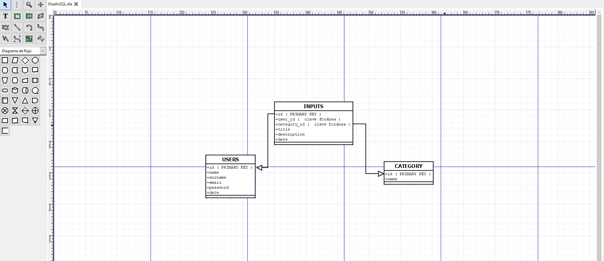

Proyecto con PHP-Javascript y MYSQL

1. Hacer el registro de usuarios en el sidebar/formulario.
2. Hacer el login de usuarios en el sidebar/formulario.
3. Página de edición de datos de los usuarios.
4. Sección de creación de categorías.
5. Sección de creación de entradas para usuarios identificados.
6. Listar entradas en la página de inicio.
7. Página de edición de entradas para usuarios logueados.
8. Poder borrar entradas “.
9. Añadir un buscador de entradas a la web.

DISEÑO DE LA BASE DE DATOS:
